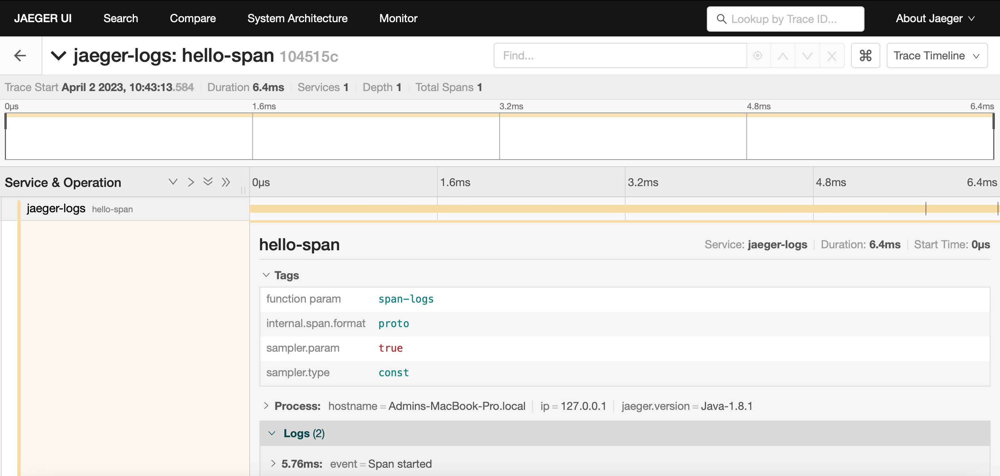
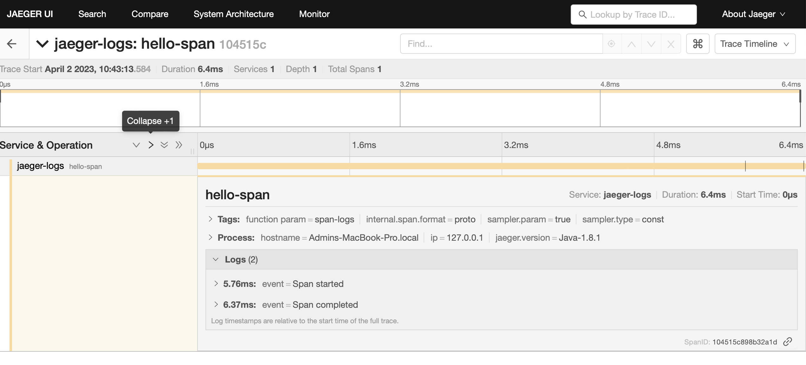

# Estudo sobre implementação do Jaeger para geração de Tracing distribuídos.

## Configuração de logs e tags
```
private void sayHello(String helloServiceArg) {

    Span span = this.tracer.buildSpan("hello-span").start();
    span.log("Span started");
    span.setTag("function param", helloServiceArg);
    
    //algum código....
    
    span.log("Span completed");
    span.finish();
}
```
**Tags** são informações que podem se acrescentadas ao span para ajudar na monitoração da aplicação.



** Logs **  são informações específicas registradas durante o span.


